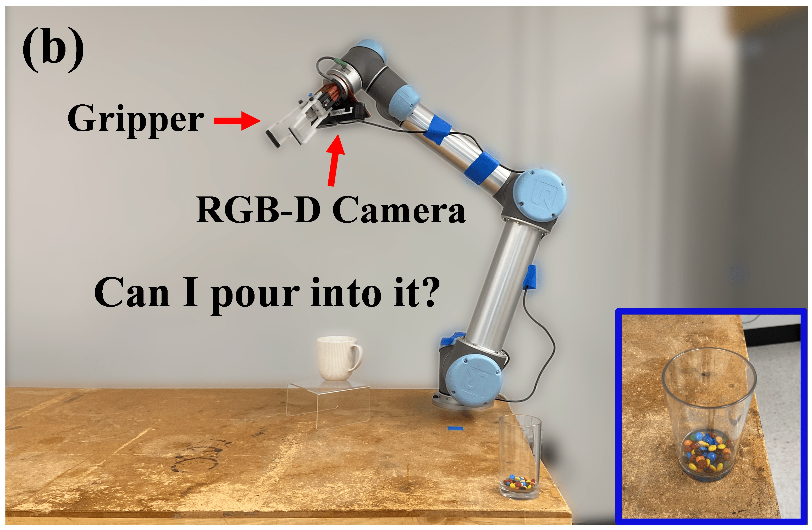

# Container Imagination
__Can I Pour into it? Robot Imagining Open Containability Affordance of Previously Unseen Objects via Physical Simulations (RA-L with ICRA 2021)__


[Hongtao Wu](https://hongtaowu67.github.io/), [Gregory Chirikjian](https://me.jhu.edu/faculty/gregory-s-chirikjian/)

Container Imagination is a method which enables robot to imagine the open containability affordance of an unseen object. With the understanding of the containability, the robot is able to identify whether the object is able to contain materials (e.g., M&M candies!) and pour a cup of the material into the object if it is identified as an open container.

<p align="center">

</p>

* [Introductory video](https://youtu.be/n6dGRaLTv88)
* [Paper on IEEE Xplore](https://ieeexplore.ieee.org/document/9269438)
* [Paper on arxiv](https://arxiv.org/abs/2008.02321)
* [Project Page & Video Results](https://chirikjianlab.github.io/realcontainerimagination/)
* [Data](https://www.dropbox.com/s/fpnxhigttq06w1w/contain_imagine_data_RAL2021.zip?dl=0)

If you have any questions or find any bugs, please let me know: <hwu67@jhu.edu>

The following image summarize our method. Click the image to watch the video:

[](https://youtu.be/n6dGRaLTv88)


# Abstract
Open containers, i.e., containers without covers, are an important and ubiquitous class of objects in human life. We propose a novel method for robots to "imagine" the open containability affordance of a previously unseen object via physical simulations. We implement our imagination method on a UR5 manipulator. The robot autonomously scans the object with an RGB-D camera. The scanned 3D model is used for open containability imagination which quantifies the open containability affordance by physically simulating dropping particles onto the object and counting how many particles are retained in it. This quantification is used for open-container vs. non-open-container binary classification. If the object is classified as an open container, the robot further imagines pouring into the object, again using physical simulations, to obtain the pouring position and orientation for real robot autonomous pouring. We evaluate our method on open container classification and autonomous pouring of granular material on a dataset containing 130 previously unseen objects with 57 object categories. Although our proposed method uses only 11 objects for simulation calibration (training), its open container classification aligns well with human judgements. In addition, our method endows the robot with the capability to autonomously pour into the 55 containers in the dataset with a very high success rate.

# Citation
If you find this code useful in your work, please consider citing
```
@article{wu2020can,
  title={Can I Pour Into It? Robot Imagining Open Containability Affordance of Previously Unseen Objects via Physical Simulations},
  author={Wu, Hongtao and Chirikjian, Gregory S},
  journal={IEEE Robotics and Automation Letters},
  volume={6},
  number={1},
  pages={271--278},
  year={2020},
  publisher={IEEE}
}
```

# Dependencies
The project has been tested on Ubuntu 16.04 with python 2.7. We are working on transfering the code to python 3 on later version of Ubuntu release.

To install the dependencies, please refer to [here](dependency.md).

# Usage

## Imagination
<p float="left">


</p>

The imagination contains two part: open containability imagination and pouring imagination. The main script for imagination is [main_imagination.py](main_imagination.py).
```
python main_imagination.py <root_dir> <data_root_dir> <data_name> <mesh_name> [-p] [-v] [-m] 
```
- root_dir: root directory of the code
- data_root_dir: root directory of the data
- data_name: name of the data in data_root_dir. Note that a data represent a capture of a scene. There may be more than one object in the scene.
- mesh_name: name of the mesh / object for imagination
- [-p]: if set as True, pouring imagination will be activated
- [-v]: if set as True, visualization of the imagination will be activated
- [-m]: if a directory is given, the video of the imagination will be saved thereof. Note that this needs to used with the [-v] option. The video name of the containabiliy imagination is object_name_contain.mp4 the video name of the pouring imagination is object_name_pour.mp4

An example argument is given as follows:
```
python main_imagination.py <root_dir> <root_dir>/data Amazon_Accessory_Tray_pour_pca Amazon_Accessory_Tray_pour_pca_mesh_0 -p True -v True -m <root_dir>/data/Amazon_Accessory_Tray_pour_pca
```
The directory of the data should be structured as follows:
```bash
├── data_root_dir
│   ├── data_name_0
│   │   ├── object_name_0.obj
│   │   ├── object_name_0_vhacd.obj
│   │   ├── object_name_0.urdf
...
```

## Real Robot Experiment
In this project, we used the PrimeSense Carmine 1.09 RGB-D camera and a UR5 robot. The gripper we used is the [AFAG EU-20 UR universal gripper](https://www.afag.com/fileadmin/user_upload/afag/Produkte/HTK_Greifen_Drehen/PDF_Files/EU_PDB_EN.pdf).

<p align="center">



</p>

To run the experiment:

1. Launch the camera
  ```
  roslaunch openni2_launch openni2.launch depth_registration:=true
  ```
2. Run the experiment. The main code for running the experiment is [main_pour.py](main_pour.py).
```
python main_pour <root_dir> <data_root_dir> <data_name> <vhacd_dir> [-p] [-r] [-v] [-m] 
```
- root_dir: root directory of the code
- data_root_dir: root directory of the data
- data_name: name of the data in data_root_dir. Note that a data represent a capture of a scene. There may be more than one object in the scene.
- vhacd_dir: directory of the V-HACD source code. To install V-HACD, see [Setup instruction](Setup.md).
- [-p]: if set as True, pouring imagination and robot pouring will be activated
- [-r]: IP address of the UR5 robot. If robot pouring is not activated, then this is useless.
- [-v]: if set as True, visualization of the imagination will be activated
- [-m]: if a directory is given, the video of the imagination will be saved thereof. Note that this needs to be used with the [-v] option. The video name of the containabiliy imagination is object_name_contain.mp4 the video name of the pouring imagination is object_name_pour.mp4

An example argument is given as follows:
```
python main_imagination.py <root_dir> <root_dir>/data Amazon_Accessory_Tray_pour_pca /home/admin/src/vhacd -p True -r 172.22.22.2 -v True -m <root_dir>/data/Amazon_Accessory_Tray_pour_pca
```

The robot will sequentially
  - scan the object
  - use TSDF fusion to recontruct the object and create a mesh of the object
  - use V-HACD to do convex decomposition of the object mesh
  - do containability imagination
  - do pouring imagination
  - pick up and pour a cup of M&M's into the object if it is identified as an open container

The directory of the data is structured as follows in the end:
```bash
├── data_root_dir
│   ├── data_name_0
│   │   ├── rgbd
│   │   │   ├── frame-000150.color.png
│   │   │   ├── frame-000150.depth.png
│   │   │   ├── frame-000150.pose.txt
│   │   │   ├── ...
│   │   │   ├── tsdf.bin
│   │   │   ├── tsdf.ply
│   │   ├── object_name_0.obj
│   │   ├── object_name_0_vhacd.obj
│   │   ├── object_name_0.urdf
│   │   ├── object_name_0_contain.mp4
│   │   ├── object_name_0_pour.mp4
...
```
rgbd/ contains the captured depth images and the corresponding pose for reconstruction. tsdf.bin and tsdf.ply are the result of the TSDF fusion of the whole scene. Objects are segment from the scene and numbered. In our setting, since there is only one object in each scene, so they are numbered as 0. object_name_0.obj is the reconstructed mesh. object_name_0_vhacd.obj is the convex decompositon mesh from V-HACD. object_name_0.urdf is the urdf file for Pybullet experiment. object_name_0.mp4 is the imagination video. xxx.HEIC is the image of the object.

The details of different modules of the experiments are listed in the following.

### Camera Calibration
------
Before running the experiment, the camera should be calibrated.

First, calibrate the instrinsic of the depth camera.
If the depth camera is registered to the rgb camera (e.g. depth_registration is activated when capturing the depth image with PrimeSense and Openni), then use the instrinsic of the rgb camera.
The camera instrinsic file should be saved in *calibrate/*. See *calibrate/camera-intrinsics.txt* for details.
For how to do camera intrinsic calibration, see [here](https://github.com/hongtaowu67/engineering_note). 

We provide a simple calibration process for hand-eye calibration. A more complete calibration toolbox can be found in [calibration toolbox repo](https://github.com/hongtaowu67/calibration_toolbox) (Franka Emika Panda robot is used in this repo). The calibration is an eye-on-hand calibration. The provided method aims to get the pose of the camera frame in the robot base frame. To do so, the robot moves to several pre-defined configurations and record the robot's end-effector pose and the pose of the calibration target.

The calibration target we used is the ArUco tag.
Make sure the [aruco_ros](https://github.com/pal-robotics/aruco_ros) ROS package is installed.
The ArUco tag can be generated and printed from [here](https://chev.me/arucogen/).
More details about how to use ArUco tag can be found in [official github repo](https://github.com/pal-robotics/aruco_ros) and [here](https://github.com/hongtaowu67/engineering_note).

To run the calibration, first specify about 20 poses of the robot to capture the calibration target.
Record the joint configurations in *self.calib_point* in [calibrate.py](calibrate.py).
Then, roslaunch the camera and aruco_ros. For PrimeSense camera
  ```
  roslaunch openni2_launch openni2.launch
  roslaunch aruco_ros single.launch markerId:=<markerId> markerSize:=<markerSize>
  ```
Run the calibration script
  ```
  python calibrate.py --save_dir <save_dir> --tcp_host_ip <tcp_host_ip>
  ```
  * save_dir: directory to save the calibration data
  * tcp_host_ip: IP address of the robot

The robot will move to the poses specified in [calibrate.py](calibrate.py) and save the calibration data in save_dir.
AXXB problem is solved with [Park & Martin method](https://ieeexplore.ieee.org/document/326576). The calibrated camera to end-effector transformation is a (4, 4) homogeneous transformation. It will be written to *save_dir/camera_pose.txt* in (16, ) format.

### Robot 3D Scanning
------
In this module, the robot autonomously moves to 24 different views to capture the view of the object placed on a transparent platform. The depth camera and the corresponding robot pose are recored in each of the view and will later be used to reconstruct the object with TSDF fusion.

Specify the capturing pose of the robot in *self.rob_joints_view* in [capture_view.py](capture_view.py). In this paper, we use 24 views. But more or less views are also ok.

### TSDF Fusion
------
TSDF fusion is used to reconstruct the volume from the depth images captured in Robot 3D Scanning.
The TSDF Fusion code is sourced from [Andy Zeng's TSDF fusion repo](https://github.com/andyzeng/tsdf-fusion) which was originally written to work with GPU. 
Here, we modify the code and provide a CPU version for running. Please follow the [Setup instruction](Setup.md) to install TSDF fusion.

### V-HACD convex decomposition
------
V-HACD is used to decompose the mesh reconstructed from TSDF fusion for physical simulation in Pybullet.
Please follow the [Setup instruction](Setup.md) to install V-HACD.


## Containability Imagination Benchmark
First, download the [dataset](https://www.dropbox.com/s/fpnxhigttq06w1w/contain_imagine_data_RAL2021.zip?dl=0).
To run the containability imagination benchmark, first generate the imagiantion result
  ```
  python containability_imagination_benchmark.py <root_dir> <data_root_dir> <result_dir>
  ```
  - root_dir: root directory of the code
  - data_root_dir: root directory of the data
  - result_dir: directory to save the result
The imagination result (txt) for each object will be saved in the <result directory>. The format of the result is:
  ```
  container <sphere_in_percentage> 0 1 2 3
  ```
The "0 1 2 3" does not have any meaning in specific.
Then, run the benchmark code to get the classification accuracy and AUC
  ```
  python benchmark_map.py <result_dir> <gt_dir>
  ```
  - result_dir: directory to save the result
  - gt_dir: directory of the ground truth

We use the <sphere_in_percentage> from the containability imagination as the confidence to calculate the classificaiton accuracy and AUC.
If <sphere_in_percentage> > 0, we classify the object as an open container.
The ground truths are saved in a similar format:
  ```
  container/noncontainer 0 1 2 3
  ```
They are obtained from human annotation. 
The "0 1 2 3" does not have any meaning in specific.

## Related Work
These are the related papers on the robot imagination project our group is working on. Please take a look!

* Is That a Chair? Imagining Affordances Using Simulations of an Articulated Human Body [[arxiv](https://arxiv.org/abs/1909.07572)] [[project page](https://chirikjianlab.github.io/chairimagination/)]

For more information about our group, please visit our website at: [https://chirikjianlab.github.io/](https://chirikjianlab.github.io/)

# TODO
- [ ] python 3 version