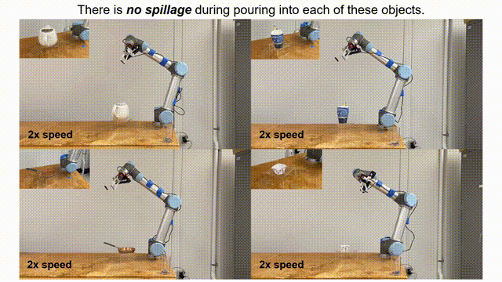
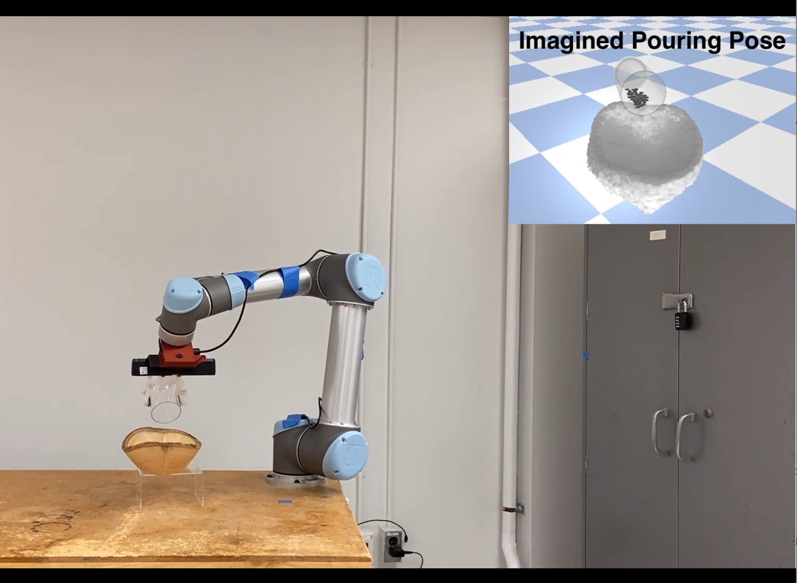
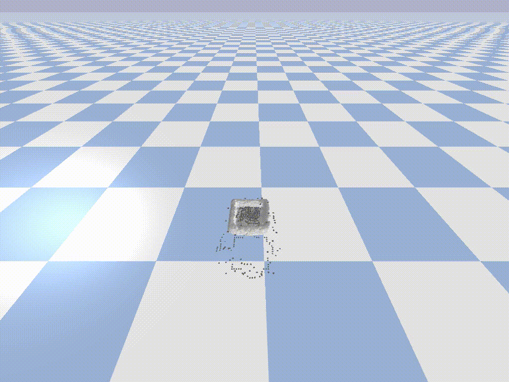
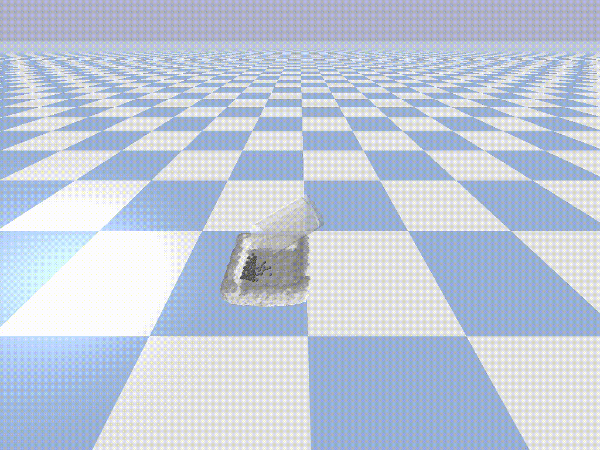

# Container Imagination
__Can I Pour into it? Robot Imagining Open Containability Affordance of Previously Unseen Objects via Physical Simulations (RA-L with ICRA 2021)__

:star:__*Best Paper Finalist in Human-Robot Interaction of ICRA 2021*__:star:

[Hongtao Wu](https://hongtaowu67.github.io/), [Gregory Chirikjian](https://me.jhu.edu/faculty/gregory-s-chirikjian/)

Container Imagination is a method to enable robot to imagine the open containability affordance of an unseen object. With the understanding of the containability, the robot is able to identify whether the object is able to contain materials (e.g., M&M candies!) and pour a cup of the material into the object if it is identified as an open container.

<p align="center">

</p>

* [Introductory video](https://youtu.be/n6dGRaLTv88)
* [Paper on IEEE Xplore](https://ieeexplore.ieee.org/document/9269438)
* [Paper on arxiv](https://arxiv.org/abs/2008.02321)
* [Project Page & Video Results](https://chirikjianlab.github.io/realcontainerimagination/)

If you have any questions or find any bugs, please let me know: <hwu67@jhu.edu>

The following image summarize our method. Click the image to watch the video:
[](https://youtu.be/n6dGRaLTv88)


# Abstract
Open containers, i.e., containers without covers, are an important and ubiquitous class of objects in human life. We propose a novel method for robots to "imagine" the open containability affordance of a previously unseen object via physical simulations. We implement our imagination method on a UR5 manipulator. The robot autonomously scans the object with an RGB-D camera. The scanned 3D model is used for open containability imagination which quantifies the open containability affordance by physically simulating dropping particles onto the object and counting how many particles are retained in it. This quantification is used for open-container vs. non-open-container binary classification. If the object is classified as an open container, the robot further imagines pouring into the object, again using physical simulations, to obtain the pouring position and orientation for real robot autonomous pouring. We evaluate our method on open container classification and autonomous pouring of granular material on a dataset containing 130 previously unseen objects with 57 object categories. Although our proposed method uses only 11 objects for simulation calibration (training), its open container classification aligns well with human judgements. In addition, our method endows the robot with the capability to autonomously pour into the 55 containers in the dataset with a very high success rate.

# Citation
If you find this code useful in your work, please consider citing
```
@article{wu2020can,
  title={Can I Pour Into It? Robot Imagining Open Containability Affordance of Previously Unseen Objects via Physical Simulations},
  author={Wu, Hongtao and Chirikjian, Gregory S},
  journal={IEEE Robotics and Automation Letters},
  volume={6},
  number={1},
  pages={271--278},
  year={2020},
  publisher={IEEE}
}
```

# Dependency
The project has been tested on Ubuntu 16.04 with python 2.7. We are working on transfering the code to python 3 on later version of Ubuntu release.

## Imagination
If you only need the imagination module, please install the following packages.
* [Pybullet](https://pybullet.org/wordpress/): the simulation engine used for the robot imagination. It can be installed by
    ```
    pip install pybullet
    ```
* scikit-learn: Principal Component Analysis (PCA) for the pouring imagination
  ```
  pip install scikit-learn
  ```
* [V-HACD](https://github.com/kmammou/v-hacd): convex decomposition of the mesh for pybullet simulation.
  ```
  git clone https://github.com/kmammou/v-hacd
  cd v-hacd/
  mkdir build && cd build
  cmake ..
  make -j8
  ```
* ffmpeg: for saving the video of the imagination process.
  ```
  sudo apt install ffmpeg
  ```

## Real Robot Experiment
If you want to include the real robot experiments (e.g., robot scanning and robot pouring), please also install the following packages. The experiment has been tested on a UR5 robot.
* [TSDF Fusion](https://github.com/hongtaowu67/TSDFfusion-cpu): 3D mesh reconstruction from the depth images capture from the camera. Please follow the instruction in the [TSDFfusion-cpu repo]((https://github.com/hongtaowu67/TSDFfusion-cpu)) to compile the package.
* [python-pcl](https://python-pcl-fork.readthedocs.io/en/rc_patches4/install.html#install-python-pcl): PCL function to work with point clouds. It is a python wrapper of the PCL library.
  ```
  pip install python-pcl
  ```
* [python-urx](https://github.com/SintefManufacturing/python-urx): a handful python wrapper to interact with UR robots.
  ```
  pip install urx
  ```


# Module

## Imagination
<p float="left">



</p>

The imagination contains two part: open containability imagination and pouring imagination. The main script for imagination is *main_imagination.py*.
```
python main_imagination.py <root_dir> <data_dir> <data_name> <mesh_name> [-p] [-v] [-m] 
```
- root_dir: root directory of the code
- data_dir: root directory of the data
- data_name: name of the data in data_dir. Note that a data represent a capture of a scene. There may be more than one object in the scene.
- mesh_name: name of the mesh / object for imagination
- [-p]: if set as True, pouring imagination will be activated
- [-v]: if set as True, visualization of the imagination will be activated
- [-m]: if a directory is given, the video of the imagination will be saved thereof. Note that this needs to used with the [-v] option. The video name of the containabiliy imagination is object_name_contain.mp4 the video name of the pouring imagination is object_name_pour.mp4

An example argument is given as follows:
```
python main_imagination.py <root_dir> <root_dir>/data Amazon_Accessory_Tray_pour_pca_mesh_0 -p True -v True -m <root_dir>/data/Amazon_Accessory_Tray_pour_pca
```
The directory of the data should be structured as follows:
```bash
├── data_dir
│   ├── data_name_0
│   │   ├── object_name_0.obj
│   │   ├── object_name_0_vhacd.obj
│   │   ├── object_name_0.urdf
...
```

## Real Robot Experiment

### Camera Calibration
We provide a simple calibration process for hand-eye calibration in the [calibration toolbox](https://github.com/hongtaowu67/calibration_toolbox). The calibration is an eye-on-hand calibration. The provided method aims to get the pose of the camera frame in the robot base frame. To do so, the robot moves to several pre-defined configurations and record the robot's end-effector pose and the pose of the calirbation target.

Before you start, please mount the camera sturdily at the end-effector of the robot. And make sure that you have already conducted the camera calibration to get the camera intrinsic (see how to do camera intrinsic calibration [here](https://github.com/hongtaowu67/engineering_note)).

In this project, we are using the PrimeSense Carmine 1.09 and a UR5 robot.

### Robot Object Scanning

### TSDF Fusion

### V-HACD convex decomposition

The real robot experiment use *containability.py* to imagine the containability. To run the real robot experiment, run
```shell
python main.py
```
Specify the data directory (directory to save the data), the content urdf and the data name in *main.py*. A directory with the object name will be created in the data directory. The RGB images, depth images, scanned 3D model file (obj), object urdf file, open containability imagination visualization (mp4), and the containability imagination results (txt) will be saved in this directory. 

## Containability Imagination Benchmark
The objects are saved in `test_set_all/` which contains 99 objects at the moment. To run the containability imagination benchmark, run
```shell
python containability_imagination.py
```
Set the content urdf, object directory, and result directory in *containability_imagination.py*. The imagination result (txt) for each objects will be saved in the result directory.

If you want to enable the pouring imagination, then run
```shell
python containability_pour.py
```
Set the content urdf, object directory, result directory, and the bottle urdf in *containability_pour.py*. The imagination result (txt) for each objects will be saved in the result directory.

To benchmark the result with human annotation, run
```shell
python benchmark_human.py
```
Specify the data directory of the imagination result txt, annotation data directory, and the corresponding annotation files in *benchmark_human.py*. The imagination result (containability and/or pouring) will be displayed.

## Related Work
These are the related papers on the robot imagination project our group is working on. Please take a look!

* Is That a Chair? Imagining Affordances Using Simulations of an Articulated Human Body [[arxiv](https://arxiv.org/abs/1909.07572)] [[project page](https://chirikjianlab.github.io/chairimagination/)]

For more information about our group, please visit our website at: [https://chirikjianlab.github.io/](https://chirikjianlab.github.io/)

## TODO
- [ ] add support on how to install TSDF Fusion and V-HACD
- [ ] move the TSDF and V-HCAD away from main_imagination
- [ ] look into pouring imagination code and add comments
- [ ] work on code for real robot experiments